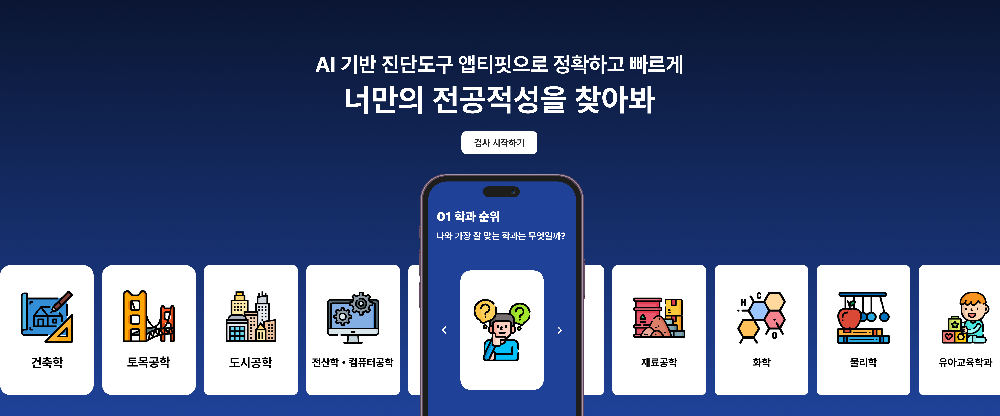

## 프로젝트 소개



**앱티핏 리빌딩 프로젝트**

주식회사 앱티마이저의 메인 서비스 '앱티핏'을 개발하면서 느꼈던 문제들과 차마 풀어내지 못했던 궁금증을 해결하기 위해 진행해보는 리빌딩하는 프로젝트다. 본 프로젝트의 목적은 한 번 만들었던 걸 다시 또 만들었다로 끝내는 것이 아니라 NextJS를 올바르게 사용했는지, 프론트엔드 개발에서 마주치는 문제들을 어떻게 해결했는지, 프론트와 서버의 커뮤니케이션을 어떻게 진행했는지 등을 정리하기 위한 것이다.

[**프로젝트 상세 문서**](https://jinuong.notion.site/2e0173d3ffd68082a574e109c6987c6a?source=copy_link)

| |  |
| :--- | :---- |
| 프로젝트 기간 | 2026년 01월 03일 - 현재 진행 중 |
| 기술 스택 | NextJS, TypeScript, TailwindCSS, Tanstack-Query, Zod |


### 프로젝트 구조
```
├── app
├──── api
├────── frontend
├────── backend
├────── database
├── feature
├── shared
```

| 디렉토리 | 설명 |
| :--- | :--- |
| `app` | 라우트 전용 디렉토리 |
| `api/backend` | 가상의 백엔드 서버 |
| `api/database` | 가상의 데이터베이스 |
| `api/frontend` | 프론트엔드용 프록시 서버 |
| `feature` | 기능별 독립 모듈 |
| `shared` | 공통 유틸리티 및 컴포넌트 |
